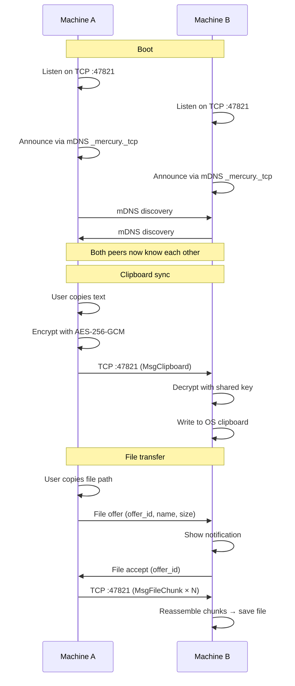

# Architecture

Mercury discovers peers via **mDNS** (`_mercury._tcp`), communicates over **TCP port 47821**, and encrypts payloads with the shared passphrase-derived key.

## High-level flow



## Packages

### `app/`: Application layer

| Package                 | Role                                                             |
| ----------------------- | ---------------------------------------------------------------- |
| `app/`                  | `MercuryApp`: main struct exposed to frontend via Wails bindings |
| `app/backend/clipboard` | Polls the OS clipboard for text / image / file URL changes       |
| `app/backend/crypto`    | AES-256-GCM encrypt/decrypt + PBKDF2 key derivation              |
| `app/backend/fileinfo`  | Detects whether copied text is a file path                       |
| `app/backend/storage`   | SQLite-backed settings persistence                               |
| `app/backend/sync`      | mDNS discovery + peer management + TCP event loop                |
| `app/backend/transfer`  | File transfer orchestration (send, receive, progress)            |
| `app/backend/transport` | Low-level TCP wire protocol (framing, dial, listen)              |
| `app/services/`         | Business logic bridging frontend IPC to backend engines          |
| `app/system/`           | System tray menu construction                                    |

### `frontend/`: Web UI

| Directory            | Role                                     |
| -------------------- | ---------------------------------------- |
| `frontend/src/`      | React app (Vite + TypeScript)            |
| `frontend/public/`   | Static assets (CSS, images)              |
| `frontend/bindings/` | Auto-generated Wails TypeScript bindings |

### `build/`: Build configuration

| File           | Role                                         |
| -------------- | -------------------------------------------- |
| `Taskfile.yml` | Build orchestration (Taskfile)               |
| `config.yml`   | Project metadata (name, identifier, version) |
| `darwin/`      | macOS app bundle, Info.plist, icons          |
| `linux/`       | nfpm config, .desktop file, AppImage         |
| `windows/`     | NSIS installer script, icons, manifest       |

## Wire protocol

All messages are sent over **TCP port 47821** with a simple frame format:

```
┌─────────┬──────────────┬─────────────────────┐
│  1 byte │  4 bytes BE  │    variable length    │
│  type   │  length      │    payload           │
├─────────┼──────────────┼─────────────────────┤
│  0x00   │  N           │  Encrypted clipboard │
│  0x01   │  N           │  Encrypted file chunk│
└─────────┴──────────────┴─────────────────────┘
```

- The **type byte** is plaintext (routing hint).
- The **payload** is always AES-256-GCM encrypted by the caller.
- File transfers use **256 KiB chunks**, each encrypted and sent independently.

## Sync Pipeline

The clipboard sync follows a straight path with no queues, no buffers, and no detours:

```
copy → poll → encrypt → broadcast → decrypt → paste
```

| Step          | Component            | What happens                                                               |
| ------------- | -------------------- | -------------------------------------------------------------------------- |
| **Copy**      | OS clipboard         | User copies text (or image, or file path) on machine A.                    |
| **Poll**      | `clipboard/watcher`  | Polls the OS clipboard every ~150ms for changes.                           |
| **Encrypt**   | `crypto`             | Encrypts the raw clipboard content with AES-256-GCM using the derived key. |
| **Broadcast** | `sync` + `transport` | Sends the encrypted payload over TCP :47821 to all connected peers.        |
| **Decrypt**   | `crypto`             | Each peer decrypts with the shared key. GCM tag mismatch → silent drop.    |
| **Paste**     | `clipboard`          | Writes the decrypted content to the local OS clipboard.                    |

Clipboard content exceeding **25 MB** is dropped before encryption. File paths are handled by file transfer, not clipboard sync.

## File Transfer Flow

```
copy path → detect file → offer → accept/reject → chunked transfer → reassemble
```

1. User copies a file path on machine A.
2. `fileinfo` detects the clipboard content is a file path, not plain text.
3. Machine A sends a **file offer** (name, size, unique offer ID) to machine B.
4. Machine B shows a notification: _"Incoming file: cat.mp4 (2.4 MB)"_.
5. User on B **accepts or declines**.
6. If accepted, machine A reads the file in **256 KiB chunks**, encrypts each chunk, and sends them over TCP.
7. Machine B reassembles the chunks in order and writes the file to the configured download directory.

If B declines, A gets a cancellation notice. No hard feelings. Files are not partially saved; the transfer either completes or it does not.

## Peer Lifecycle

```
`Discovery → Send → Fail → Eviction → Re-discovery`
```

| Phase            | What happens                                                                                                                                                              |
| ---------------- | ------------------------------------------------------------------------------------------------------------------------------------------------------------------------- |
| **Discovery**    | mDNS announces `_mercury._tcp` on the LAN. Other Mercury instances respond with their IP and port.                                                                        |
| **Send**         | Every clipboard broadcast or file chunk send is a TCP connection to each peer. A successful send resets that peer's failure counter.                                        |
| **Eviction**     | A peer with 3 consecutive send failures is evicted. Wrong passphrase (GCM auth failure) logs a warning on the sender side, but the peer is not evicted — they just cannot decrypt. |
| **Re-discovery** | Mercury continuously listens for mDNS announcements. A peer that comes back online is re-discovered within seconds. No manual reconnection needed.                        |

## Performance Constraints

| Metric                     | Limit                           | Why                                                        |
| -------------------------- | ------------------------------- | ---------------------------------------------------------- |
| Clipboard payload          | 25 MB max                       | Beyond this is abuse, not clipboard sync                   |
| File chunk size            | 256 KiB                         | Balances encryption overhead vs throughput                 |
| Peer eviction              | 3 consecutive send failures     | A send failure resets on success; 3 strikes and you are out |
| mDNS interval              | ~2 seconds                      | Standard mDNS timing                                       |
| Clipboard poll rate        | ~150 ms                         | Fast enough to feel instant, slow enough to not peg a core |
| Max simultaneous transfers | 1 per peer                      | Keeps the wire protocol simple                             |
